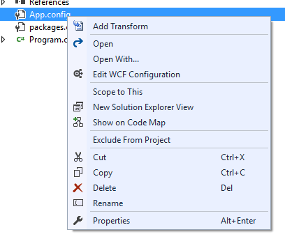
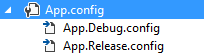
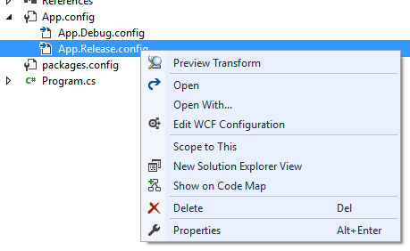
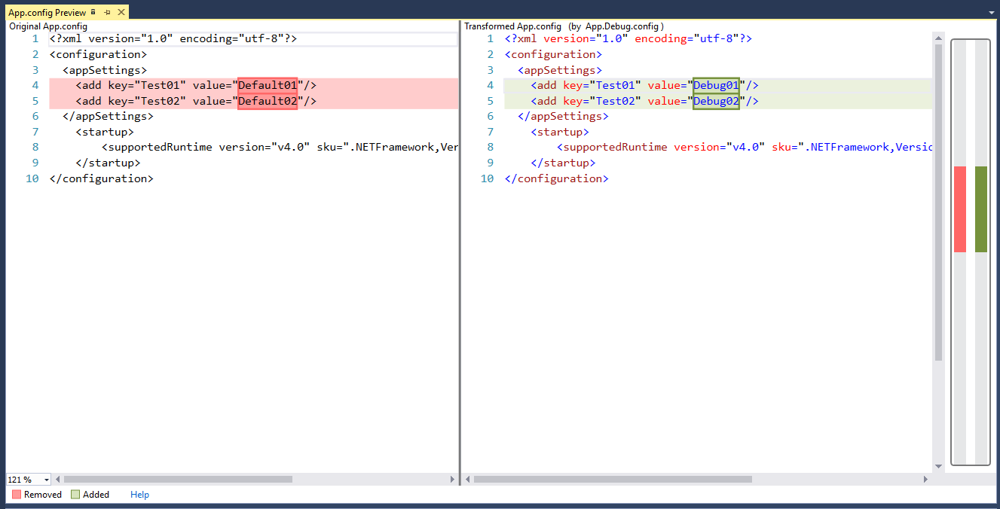

# Transforming Files with SlowCheetah

## Summary
The [SlowCheetah Visual Studio extension](https://marketplace.visualstudio.com/items?itemName=vscps.SlowCheetah-XMLTransforms) allows you to add and preview transformation to files in your project.

The [SlowCheetah NuGet package](https://www.nuget.org/packages/Microsoft.VisualStudio.SlowCheetah) is required for build-time transformations, which are discussed in more detail below.

## Getting Started

Once the SlowCheetah extension has been installed, transformations are added by right-clicking a file. If the file type is supported, the `Add Transform` option should be visible.



Selecting this option will add transform files according to your project's [build configurations](https://docs.microsoft.com/en-us/visualstudio/ide/understanding-build-configurations). If the project has any publish profiles, transform files are also created for them.



To quickly preview the transformations, right-click any of the transform files and select the `Preview Transform` option.





## Executing Build-Time Transformations

The SlowCheetah NuGet package adds transformations logic to the build process of the project. By adding transforms using the extension and having the package installed to the project, transformations will be executed on build.

It is possible to perform build-time transformation using only the NuGet package. Files that should be transformed require the `TransformOnBuild` metadata set to true. Files that specify the transformations should have the `IsTransformFile` metadata set to true. If your project supports the `DependentUpon` metadata, add that to the transform files, specifying the original file. The resulting project file would look similar to this:

``` xml
<None Include="App.config">
    <TransformOnBuild>true</TransformOnBuild>
</None>
<None Include="App.Debug.config">
    <DependentUpon>App.config</DependentUpon>
    <IsTransformFile>True</IsTransformFile>
</None>
<None Include="App.Release.config">
    <DependentUpon>App.config</DependentUpon>
    <IsTransformFile>True</IsTransformFile>
</None>
```
